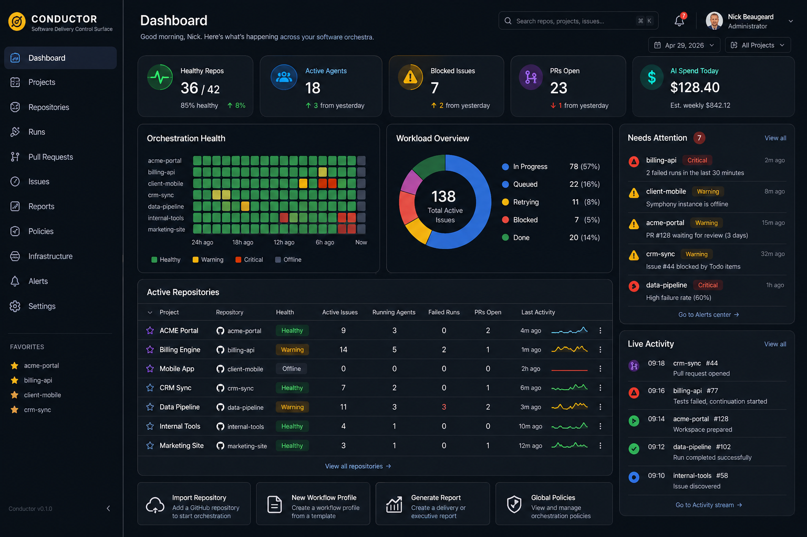

## The Conductor

**Conductor** should be the fleet control layer above Symphony.

Symphony is the musician.
Conductor is the person standing in front of the whole orchestra, seeing every project, every repo, every active issue, every failed run, every token burn, every blocked task and every delivery risk.

Conductor should not replace Symphony. It should supervise many Symphony instances, provision them, start them, stop them, collect their telemetry, standardise their configuration and present a beautiful software-company control surface.


---

# Conductor: System Design

## 1. Core idea

Conductor manages many GitHub repositories and can run a Symphony instance for each repository in one of three execution modes:

1. **Local process**

   * Starts Symphony directly on the host machine.
   * Best for a dev workstation or small internal server.
   * Fastest to build.
   * Least isolated.

2. **Local container**

   * Starts one Symphony container per repository.
   * Uses Docker or Podman.
   * Good for an internal build/orchestration server.
   * Clean isolation per repo.
   * Easier cleanup and restart.

3. **Azure container**

   * Starts one Symphony runtime per repo using Azure Container Apps, Azure Container Instances, or Azure Kubernetes Service.
   * Best for a serious multi-project software company.
   * Gives isolation, scaling, managed identity, central logs and operational control.

The MVP should support local process and local Docker first. Azure should be designed from day one but implemented second.

---

# 2. Recommended architecture

```text
+--------------------------------------------------------------+
|                        Conductor UI                          |
|  Portfolio dashboard | Repo drilldown | Runs | Reports | Ops  |
+-----------------------------+--------------------------------+
                              |
                              v
+--------------------------------------------------------------+
|                     Conductor API                            |
|  Repos | Symphony Instances | Runs | Reports | Config | Auth  |
+-----------------------------+--------------------------------+
                              |
                              v
+--------------------------------------------------------------+
|                 Conductor Orchestration Core                 |
|                                                              |
|  Scheduler     Provisioner     Health Monitor     Collector  |
|  Reporter      GitHub Sync     Secret Broker      Policy     |
+---------+-------------+-------------+-------------+----------+
          |             |             |             |
          v             v             v             v
+----------------+ +-------------+ +-------------+ +------------+
| Local Runner   | | Docker      | | Azure       | | GitHub     |
| dotnet/service | | Runner      | | Runner      | | Connector  |
+----------------+ +-------------+ +-------------+ +------------+
          |             |             |
          v             v             v
+--------------------------------------------------------------+
|                  Symphony Instances                          |
|  one per repo, or eventually one per repo/workflow profile    |
+--------------------------------------------------------------+
          |
          v
+--------------------------------------------------------------+
|  Symphony APIs: /health /runtime /state /issue /refresh       |
+--------------------------------------------------------------+
```

---

# 3. Why one Symphony instance per repo

That matches Symphony’s current design.

Symphony’s current container guide says today’s supported deployment is one long-running orchestrator container with SQLite on a mounted volume, workspaces on a mounted volume, external `WORKFLOW.md`, injected `GITHUB_TOKEN`, and Codex running inside the same container as the orchestrator.

That is ideal for Conductor. Each repository becomes a managed “instrument”:

```text
Repo: ReleasedGroup/ProductA
  Symphony Instance: product-a-main
  Mode: Docker
  Status: Healthy
  Active Issues: 6
  Running Agents: 3
  Failed Runs: 1
  Token Spend: $18.42 today
  Last Refresh: 2 minutes ago
```

Do not try to force one Symphony instance to manage every repo yet. You would end up fighting the current repo-owned `WORKFLOW.md` model.

---

# 4. Main components

## A. Conductor API

A `.NET 10` ASP.NET Core API, keeping the same technology family as Symphony.

Responsibilities:

* Register repositories.
* Generate and manage per-repo `WORKFLOW.md`.
* Start, stop and restart Symphony instances.
* Poll each Symphony instance.
* Store consolidated state.
* Expose portfolio-level APIs for the UI.
* Manage execution modes.
* Manage secrets without leaking PATs into logs.
* Generate reports.

Suggested projects:

```text
src/Conductor.Host
src/Conductor.Core
src/Conductor.Infrastructure.Persistence
src/Conductor.Infrastructure.GitHub
src/Conductor.Infrastructure.Runners.Local
src/Conductor.Infrastructure.Runners.Docker
src/Conductor.Infrastructure.Runners.Azure
src/Conductor.Web
tests/Conductor.Tests
```

---

## B. Instance Provisioner

This creates the runtime package for a repo.

For each managed repo, Conductor should generate:

```text
/data/conductor/instances/{instanceId}/
  config/
    WORKFLOW.md
  state/
    conductor-instance.json
  logs/
  symphony-data/
    symphony.db
    workspaces/
    codex-home/
```

For Docker mode:

```text
docker run \
  --name conductor-symphony-releasedgroup-producta \
  -e GITHUB_TOKEN=... \
  -e Persistence__ConnectionString="Data Source=/var/lib/symphony/symphony.db" \
  -e Orchestration__InstanceId="releasedgroup-producta-main" \
  -e ASPNETCORE_URLS="http://0.0.0.0:8080" \
  -v /data/conductor/instances/producta/config:/config \
  -v /data/conductor/instances/producta/symphony-data:/var/lib/symphony \
  -v /data/conductor/codex-home/producta:/home/symphony/.codex \
  -p 18081:8080 \
  releasedgroup/symphony:latest
```

This aligns with Symphony’s container guidance: external `WORKFLOW.md`, mounted SQLite/workspace volume, injected token, and mounted Codex home.

---

## C. Runner abstraction

Use a clean interface:

```csharp
public interface ISymphonyRunner
{
    Task<ProvisionedInstance> ProvisionAsync(SymphonyInstanceSpec spec, CancellationToken ct);
    Task StartAsync(SymphonyInstanceId id, CancellationToken ct);
    Task StopAsync(SymphonyInstanceId id, CancellationToken ct);
    Task RestartAsync(SymphonyInstanceId id, CancellationToken ct);
    Task<InstanceHealth> GetHealthAsync(SymphonyInstanceId id, CancellationToken ct);
    Task<InstanceLogs> GetLogsAsync(SymphonyInstanceId id, LogQuery query, CancellationToken ct);
    Task DestroyAsync(SymphonyInstanceId id, CancellationToken ct);
}
```

Implementations:

```text
LocalProcessSymphonyRunner
DockerSymphonyRunner
AzureContainerAppsSymphonyRunner
AzureContainerInstancesSymphonyRunner
```

Do **not** put Azure-specific logic in the domain model. Keep it in infrastructure.

---

## D. Symphony State Collector

Symphony already exposes useful APIs:

* `GET /api/v1/health`
* `GET /api/v1/runtime`
* `GET /api/v1/state`
* `GET /api/v1/<issue_identifier>`
* `POST /api/v1/refresh`

The user guide says `/api/v1/state` includes running sessions, retry queue, tracked issue distribution, recent activity, lease state, token totals, runtime totals and latest rate limits.

Conductor should poll those endpoints and normalise the data into its own database.

Recommended polling:

```text
Health:       every 10 seconds
State:        every 30 seconds
Runtime:      every 2 minutes
Issue detail: on demand
Logs:         streamed or fetched only when requested
```

Also support push-style ingestion later:

```text
Symphony -> webhook/event sink -> Conductor
```

But polling is fine for the first version.

---

# 5. Conductor data model

Use SQL Server or PostgreSQL for Conductor. SQLite is fine for Symphony instance state, but Conductor is portfolio-level operational software. Use a proper central database.

## Core tables

```text
Projects
- Id
- Name
- ClientName
- Status
- DefaultBranch
- CreatedAt
- UpdatedAt

Repositories
- Id
- ProjectId
- Provider
- Owner
- Name
- FullName
- CloneUrl
- DefaultBranch
- Visibility
- IsArchived
- LastSyncedAt

SymphonyInstances
- Id
- RepositoryId
- Name
- ExecutionMode
- BaseUrl
- Port
- ContainerName
- AzureResourceId
- Status
- HealthStatus
- Version
- WorkflowPath
- DataPath
- CreatedAt
- LastStartedAt
- LastSeenAt

WorkflowProfiles
- Id
- RepositoryId
- Name
- ActiveStatesJson
- TerminalStatesJson
- LabelsJson
- MilestonesJson
- MaxConcurrentAgents
- MaxTurns
- CodexTimeoutsJson
- PromptTemplate
- IsDefault

InstanceSnapshots
- Id
- SymphonyInstanceId
- CapturedAt
- HealthJson
- RuntimeJson
- StateJson
- ActiveIssueCount
- RunningSessionCount
- RetryQueueCount
- FailedRunCount
- TokenInputTotal
- TokenOutputTotal

TrackedIssues
- Id
- RepositoryId
- GitHubIssueNumber
- Title
- State
- LabelsJson
- Milestone
- AssigneeLoginsJson
- Url
- SymphonyStatus
- LastRunStatus
- LastActivityAt
- IsBlocked
- BlockerReason

Runs
- Id
- SymphonyInstanceId
- RepositoryId
- GitHubIssueNumber
- SymphonyRunId
- Status
- StartedAt
- FinishedAt
- AttemptCount
- TokenInput
- TokenOutput
- ErrorSummary
- BranchName
- PullRequestUrl

RunAttempts
- Id
- RunId
- AttemptNumber
- Status
- StartedAt
- FinishedAt
- ExitReason
- ErrorDetail

Events
- Id
- SymphonyInstanceId
- RepositoryId
- IssueNumber
- Severity
- EventType
- Message
- PayloadJson
- OccurredAt

Reports
- Id
- ReportType
- Scope
- PeriodStart
- PeriodEnd
- GeneratedAt
- Markdown
- Html
- PdfPath
```

---

# 6. Control surface UI

This should not look like a developer afterthought. It should look like mission control for a software company.

## A. Portfolio dashboard

Top-level view:

```text
Good morning, Nick.
42 repositories under orchestration.
18 active agents.
7 repos need attention.
3 blocked delivery risks.
$128.40 estimated AI usage today.
```

Cards:

* Active projects
* Active repositories
* Running Symphony instances
* Running agents
* Issues in progress
* Issues blocked
* Failed runs
* Pull requests opened
* Token usage today
* Estimated cost this week

Main grid:

| Project        |          Repo |  Health | Active | Running | Failed | Blocked | PRs | Last Activity |
| -------------- | ------------: | ------: | -----: | ------: | -----: | ------: | --: | ------------- |
| ACME Portal    |   acme-portal | Healthy |      9 |       3 |      0 |       1 |   2 | 4 mins ago    |
| Billing Engine |   billing-api | Warning |     14 |       5 |      2 |       0 |   1 | 1 min ago     |
| Mobile App     | client-mobile | Offline |      0 |       0 |      0 |       0 |   0 | 2 hrs ago     |

Visual treatment:

* Dark mode first.
* Strong contrast.
* Green/amber/red instance states.
* Timeline sparklines.
* Big “needs attention” rail.
* GitHub-style links.
* “Orchestration health” separate from “project delivery health”.

---

## B. Repository command centre

For one repo:

```text
ReleasedGroup / ProductA
Mode: Docker
Symphony: Healthy
Branch: main
Workflow: Product Standard
```

Sections:

1. **Instance health**

   * Uptime
   * Current version
   * Last poll
   * API latency
   * Container/process state
   * Restart button

2. **Workload**

   * Active issues
   * Running sessions
   * Queued/retrying
   * Terminal/closed
   * Blocked by `Todo` or labels

3. **Agent activity**

   * Live sessions
   * Current issue
   * Started at
   * Last Codex activity
   * Token usage
   * Current turn
   * Timeout risk

4. **Recent events**

   * Run started
   * GitHub issue refreshed
   * Branch created
   * PR opened
   * Run failed
   * Retry scheduled
   * Workspace cleaned

5. **Issue drill-down**

   * GitHub issue summary
   * Symphony run status
   * Attempts
   * Session events
   * Branch/worktree
   * PR status
   * Logs

6. **Workflow editor**

   * Rendered `WORKFLOW.md`
   * YAML front matter editor
   * Prompt template editor
   * Validate before save
   * Compare against company standard profile

Symphony already has a dashboard and workflow editor, but Conductor should make those fleet-aware and policy-aware. Symphony can keep the local dashboard for emergency inspection.

---

## C. Run timeline

Each issue should show a beautiful timeline:

```text
#128 Add customer export endpoint

09:14  Issue discovered
09:15  Workspace prepared
09:15  Branch created: symphony/128-customer-export
09:16  Codex session started
09:22  Files changed: 8
09:24  Tests running
09:26  Test failure detected
09:27  Codex continuation turn started
09:35  Tests passed
09:36  Pull request opened
09:37  Waiting for human review
```

This is where Conductor becomes useful to managers, not just developers.

---

## D. Executive reporting

Reports should be generated as Markdown, HTML and PDF.

Useful reports:

1. **Daily Delivery Brief**

   * What moved yesterday
   * What is being worked on now
   * What is blocked
   * What failed
   * What needs human review

2. **Weekly Software Factory Report**

   * Repos active
   * Issues completed
   * PRs opened
   * PRs merged
   * Agent hours
   * Human review backlog
   * AI token usage/cost
   * Failure categories
   * Delivery risks

3. **Client Project Report**

   * Plain-English status
   * Features completed
   * Bugs fixed
   * Items awaiting approval
   * Risks
   * Next week’s plan

4. **Engineering Reliability Report**

   * Failing repos
   * Repeat failure patterns
   * Long-running issues
   * Stalled sessions
   * Flaky tests
   * Rate-limit pressure
   * Repos missing workflow standards

---

# 7. GitHub integration

Conductor should integrate with GitHub at two levels.

## Organisation/repo discovery

* List accessible orgs.
* List repositories.
* Import selected repos.
* Detect:

  * default branch
  * visibility
  * archived status
  * open issues
  * labels
  * milestones
  * pull requests
  * branch protection
  * GitHub Actions status

## Operational write-back

Optional but powerful:

* Add labels such as:

  * `conductor:managed`
  * `symphony:running`
  * `symphony:blocked`
  * `symphony:failed`
  * `human-review`
* Comment on issues when Symphony starts or fails.
* Link Conductor run URL from GitHub issue comments.
* Create project-level status comments.
* Add PR check summaries.

Be careful here. Too much bot chatter in GitHub becomes annoying quickly. Use comments for exceptions and human-needed events, not every state transition.

---

# 8. Secrets and identity

Do not let every Symphony instance have a full-power PAT if you can avoid it.

Recommended levels:

## MVP

* Store encrypted GitHub PAT in Conductor.
* Inject as `GITHUB_TOKEN` into each instance.
* Mask all secrets in logs.
* Use Windows DPAPI, Azure Key Vault, or ASP.NET Core Data Protection.

## Better

* Use GitHub App authentication instead of PATs.
* Generate short-lived installation tokens per org/repo.
* Conductor acts as token broker.
* Symphony receives only a short-lived token.

## Azure

* Azure Key Vault for:

  * GitHub App private key
  * Codex credentials
  * container registry credentials
* Managed Identity for Conductor.
* No static secrets in container environment where avoidable.

---

# 9. Execution modes

## Mode 1: Local process

Good for development.

```text
Conductor starts:
dotnet Symphony.Host.dll /path/to/WORKFLOW.md --port 18081
```

Pros:

* Simple.
* Fast.
* Easy debugging.

Cons:

* Weak isolation.
* Messy cleanup.
* Bad for many repos.
* More likely to have path and environment problems.

Use this only for MVP/dev.

---

## Mode 2: Local container

Best early production mode.

Each repo gets a container:

```text
conductor-symphony-{owner}-{repo}
```

Each container gets:

* mounted `WORKFLOW.md`
* mounted SQLite/workspace volume
* mounted Codex home
* injected GitHub token
* assigned local port
* health checks
* restart policy

Pros:

* Good isolation.
* Easy restart.
* Easy delete/recreate.
* Works on a single beefy VM.
* Closely matches Symphony’s documented container model.

Cons:

* Still host-bound.
* Requires Docker.
* Needs careful disk cleanup.

This is the best first serious target.

---

## Mode 3: Azure Container Apps

Best cloud mode for a software company.

Recommended structure:

```text
Azure Resource Group: rg-conductor-prod
Azure Container App Environment: cae-conductor-prod
Container App: conductor-api
Container Apps: symphony-{repo}
Azure SQL: conductor-db
Azure Files / Azure Disk: per-instance workspace/state
Azure Key Vault: secrets
Azure Container Registry: Symphony and Conductor images
Application Insights / Log Analytics
```

Pros:

* Scales.
* Managed.
* Good observability.
* Good security story.
* Suitable for client-facing reporting.

Cons:

* More moving parts.
* Persistent workspace handling needs design.
* Container Apps persistent storage is not as natural as local Docker volumes.

For Azure, decide early whether Symphony workspaces should be:

1. Azure Files mounted into each container.
2. Ephemeral workspace recreated per run.
3. A dedicated persistent disk per instance.
4. A move toward remote agent jobs later.

For the current Symphony design, option 1 is the most practical.

---

# 10. Policy model

Conductor should let the company define orchestration policies.

Examples:

```yaml
policy:
  max_repos_running: 20
  max_agents_global: 50
  max_agents_per_repo: 5
  max_token_cost_per_day: 200
  business_hours_only: false
  require_human_approval_for:
    - database_migrations
    - public_api_changes
    - security_sensitive_files
  pause_on:
    - repeated_test_failures
    - github_rate_limit_low
    - token_budget_exceeded
```

Policy should answer:

* Which repos may run?
* How many agents can run?
* What is the budget?
* What requires human review?
* What stops automatically?
* What triggers alerts?

---

# 11. Alerts

Conductor should alert when:

* Symphony instance is offline.
* Container repeatedly restarts.
* Run has stalled.
* Issue failed more than N times.
* GitHub rate limit is low.
* Token spend is high.
* Worktree cleanup failed.
* Repo has active issues but no running agent.
* PRs are waiting too long for review.
* Workflow config has drifted from the standard profile.

Alert channels:

* Email
* Teams
* Slack
* GitHub issue comment
* Conductor notification centre

For your world, Teams is probably the most important.

---

# 12. Beautiful control surface design

## Visual metaphor

Use the orchestra metaphor without making it cheesy.

Language:

* **Portfolio**: the full orchestra
* **Project**: section
* **Repository**: instrument
* **Symphony instance**: player
* **Run**: performance
* **Workflow profile**: score
* **Policy**: tempo
* **Report**: programme notes

Avoid overdoing it. Keep engineering labels clear.

## Main navigation

```text
Dashboard
Projects
Repositories
Runs
Pull Requests
Reports
Policies
Infrastructure
Settings
```

## Dashboard wireframe

```text
+--------------------------------------------------------------------------------+
| Conductor                                                        Search...      |
| Software Delivery Control Surface                              Nick Beaugeard   |
+--------------------------------------------------------------------------------+

  Healthy Repos       Active Agents       Blocked Issues       AI Spend Today
  36 / 42             18                  7                    $128.40

+--------------------------------------+-----------------------------------------+
| Delivery Health                      | Needs Attention                         |
|                                      | 1. billing-api: 2 failed runs            |
| [repo status heatmap]                | 2. mobile-app: Symphony offline          |
|                                      | 3. acme-portal: PR waiting 3 days        |
+--------------------------------------+-----------------------------------------+

+--------------------------------------------------------------------------------+
| Active Repositories                                                            |
| Project      Repo              Health    Active  Running  Failed  PRs  Updated |
| ACME         acme-portal       Healthy   9       3        0       2    4m ago  |
| Internal     billing-api       Warning   14      5        2       1    1m ago  |
| Client X     mobile-app        Offline   0       0        0       0    2h ago  |
+--------------------------------------------------------------------------------+

+--------------------------------------------------------------------------------+
| Live Agent Timeline                                                            |
| 09:14  acme-portal #128 workspace prepared                                     |
| 09:16  billing-api #77 tests failed, continuation started                      |
| 09:18  crm-sync #44 PR opened                                                  |
+--------------------------------------------------------------------------------+
```

---

# 13. API design

## Repositories

```http
GET    /api/repos
POST   /api/repos/import
GET    /api/repos/{id}
PUT    /api/repos/{id}
DELETE /api/repos/{id}
```

## Instances

```http
GET    /api/instances
POST   /api/instances
GET    /api/instances/{id}
POST   /api/instances/{id}/start
POST   /api/instances/{id}/stop
POST   /api/instances/{id}/restart
POST   /api/instances/{id}/refresh
GET    /api/instances/{id}/health
GET    /api/instances/{id}/state
GET    /api/instances/{id}/logs
```

## Runs

```http
GET    /api/runs
GET    /api/runs/{id}
POST   /api/runs/{id}/cancel
POST   /api/runs/{id}/retry
```

## Reports

```http
GET    /api/reports
POST   /api/reports/daily
POST   /api/reports/weekly
POST   /api/reports/project/{projectId}
GET    /api/reports/{id}
GET    /api/reports/{id}/pdf
```

## Policies

```http
GET    /api/policies
POST   /api/policies
PUT    /api/policies/{id}
POST   /api/policies/{id}/apply
```

---

# 14. How Conductor fires Symphony

## Local process flow

```text
1. User imports repo.
2. Conductor generates WORKFLOW.md.
3. Conductor allocates port.
4. Conductor starts Symphony process.
5. Conductor stores process id.
6. Health monitor polls /api/v1/health.
7. State collector polls /api/v1/state.
8. UI shows live state.
```

## Docker flow

```text
1. User imports repo.
2. Conductor creates instance folder.
3. Conductor writes WORKFLOW.md.
4. Conductor creates Docker volume/bind mount paths.
5. Conductor starts Symphony container.
6. Health monitor waits for /health.
7. Collector begins polling.
8. Logs are read from Docker.
```

## Azure flow

```text
1. User imports repo.
2. Conductor writes instance definition.
3. Conductor stores secrets in Key Vault.
4. Conductor provisions Container App.
5. Azure Files mount provides workspace/state.
6. Symphony starts with mounted WORKFLOW.md.
7. Collector polls private/internal endpoint.
8. Logs flow to Log Analytics.
```

---

# 15. What needs changing in Symphony

You can build Conductor without changing Symphony much. But these additions would make Conductor far better:

## Add version endpoint

```http
GET /api/v1/version
```

Return:

```json
{
  "version": "1.3.0",
  "commit": "abc123",
  "buildTime": "2026-04-29T00:00:00Z"
}
```

## Add structured event stream

```http
GET /api/v1/events/stream
```

Server-sent events would reduce polling.

## Add admin pause/resume

```http
POST /api/v1/pause
POST /api/v1/resume
```

Conductor needs to stop scheduling without killing the container.

## Add graceful shutdown endpoint

```http
POST /api/v1/shutdown
```

Useful for local process/container management.

## Add instance capabilities endpoint

```http
GET /api/v1/capabilities
```

So Conductor can detect whether the Symphony instance supports workflow editing, events, pause/resume, etc.

## Add machine-readable workflow validation

```http
POST /api/v1/workflow/validate
```

The user guide says Symphony already validates workflow edits before saving.  Exposing that explicitly would help Conductor validate generated profiles before deployment.

---

# 16. MVP build plan

## Phase 1: Fleet visibility

Goal: See many Symphony instances in one place.

Build:

* Conductor API
* Database
* Repository registry
* Symphony instance registry
* Health polling
* State polling
* Portfolio dashboard
* Repo drill-down
* Manual instance registration by URL

This phase does not provision anything. It just monitors.

Result:

```text
“I can point Conductor at 10 Symphony instances and see everything.”
```

---

## Phase 2: Local Docker orchestration

Goal: Conductor can create and run Symphony containers.

Build:

* Docker runner
* Instance folder generation
* Port allocation
* `WORKFLOW.md` generator
* Start/stop/restart
* Container logs
* Basic secret injection
* Import GitHub repo wizard

Result:

```text
“I can select a GitHub repo, choose a workflow profile, click Start, and Conductor runs Symphony for it.”
```

---

## Phase 3: Reporting

Goal: Make it useful to the business.

Build:

* Daily delivery brief
* Weekly software factory report
* Project/client report
* Markdown/HTML/PDF output
* Email/Teams delivery
* Cost and token summaries
* Failure category summaries

Result:

```text
“I can run a software company from the Conductor dashboard and reports.”
```

---

## Phase 4: Azure runner

Goal: Cloud-hosted production.

Build:

* Azure Container Apps runner
* Azure Key Vault integration
* Azure Files mount
* Log Analytics links
* Managed Identity
* Private networking option
* Per-instance scaling controls

Result:

```text
“I can run Symphony per repo in Azure and manage the fleet from Conductor.”
```

---

## Phase 5: Policy and governance

Goal: Make it safe at scale.

Build:

* Global concurrency limits
* Per-project budgets
* Auto-pause on repeated failures
* Human review requirements
* Workflow profile compliance
* GitHub label/comment write-back
* Approval queue

Result:

```text
“Conductor is not just a dashboard. It governs automated software delivery.”
```

---

# 17. Suggested technology stack

Given your world, I would build it this way:

```text
Backend:
- .NET 10
- ASP.NET Core
- EF Core
- SQL Server or PostgreSQL
- BackgroundService workers
- SignalR for live UI updates

Frontend:
- Blazor Server or React/TypeScript
- Tailwind CSS
- shadcn-style component language if React
- SignalR live updates

Infrastructure:
- Docker Engine API for local containers
- Azure SDK for Container Apps
- Azure Key Vault
- Application Insights
- GitHub App auth eventually

Reports:
- Markdown first
- HTML templates
- Playwright PDF rendering
```

For speed, I would use **Blazor Server** first because this is an internal operations app and you are already deep in .NET. If you want it to feel more like a premium SaaS product, use React.

---

# 18. Opinionated recommendation

Build Conductor as a separate product, not as a feature inside Symphony.

Why:

* Symphony should stay focused on one repo and one workflow.
* Conductor should own fleet management, reporting, policy and infrastructure.
* You will want Conductor to manage versions, restart bad instances, compare repos and create executive reports.
* That is a different concern from actually running the coding agent loop.

The clean product split is:

```text
Symphony
Single-repo coding-agent orchestrator.

Conductor
Multi-repo software delivery control surface and fleet manager.
```

That gives you a proper story:

> Symphony automates software work from GitHub issues. Conductor lets a software company run Symphony across all projects, with visibility, control, governance and reporting.

That is a strong product narrative. It also makes the architecture cleaner.
